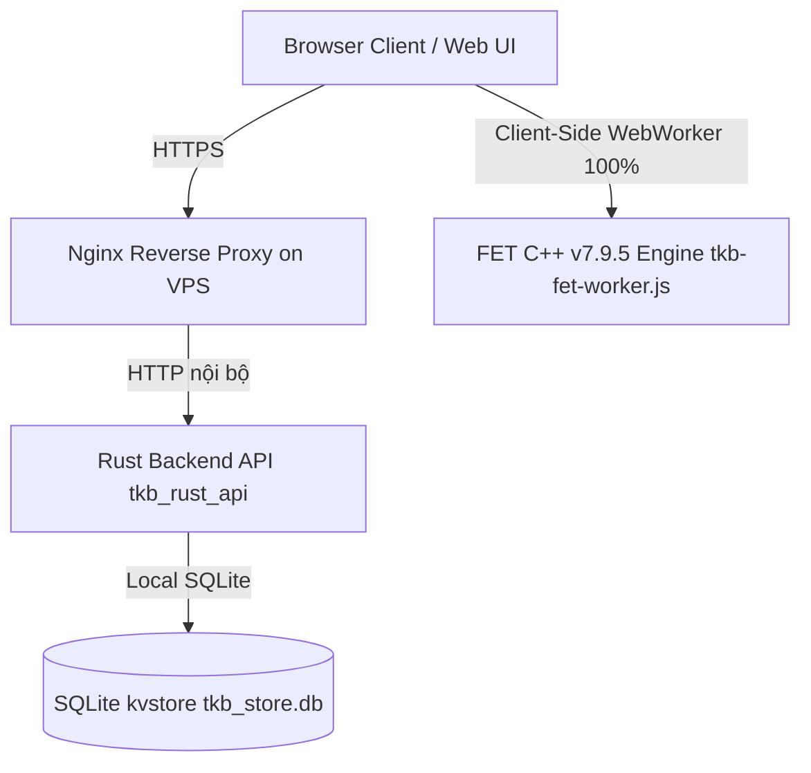

# HƯỚNG DẪN KẾ THỪA VÀ VẬN HÀNH DỰ ÁN TKB CHERRY (TKB TIMETABLE SYSTEM)
*Tài liệu bàn giao kỹ thuật toàn diện dành cho lập trình viên kế thừa dự án.*

> **Đọc kèm:** trạng thái hiện hành ngắn gọn nằm ở [`docs/CURRENT_STATE.md`](docs/CURRENT_STATE.md);
> nhật ký chi tiết từng phiên làm việc ở [`docs/PROJECT_HANDOFF.md`](docs/PROJECT_HANDOFF.md)
> (các mục cũ được chuyển vào `docs/archive/`).

---

## 1. TỔNG QUAN HỆ THỐNG VÀ KIẾN TRÚC (SYSTEM ARCHITECTURE)

Hệ thống **TKB Cherry** (`tkbcherry.com`) là nền tảng quản lý và xếp thời khóa biểu tự động thông minh dành cho trường học phổ thông, hỗ trợ quy mô trường lớn (hơn 75 lớp, hàng ngàn tiết học, hàng trăm giáo viên) với tốc độ giải siêu tốc dưới 200 ms trực tiếp trên trình duyệt.



### Các thành phần chính:
1. **Web Client (Frontend)**:
   * **Công nghệ**: HTML5, Vanilla JavaScript (ES6+), Vanilla CSS3. Không dùng framework hay build system; giao tiếp backend qua HTTP polling (không WebSocket).
   * **Giao diện phân môn & sắp xếp TKB**: `web/pages/phanmon.js`, `web/pages/sapxep.html`, `web/pages/phanmon.css`.
   * **Bộ giải & tối ưu FET 100% Client-Side Web Worker**: `web/pages/tkb-fet-engine.js`, `web/pages/tkb-fet-worker.js`. Toàn bộ quá trình xếp TKB (Play ▶ / Stop ■) chạy cục bộ trên trình duyệt không qua network. Đã gỡ bỏ toàn bộ phụ thuộc legacy CP-SAT / Cloud Run / Rust solver bridge trên giao diện xếp lịch.
   * **Quản trị hệ thống & Cổng trường học**: `web/super-admin.js`, `web/school-portal.js`, `web/app.js`.

2. **Backend API Server (Rust)**:
   * **Thư mục**: `rust_api/`
   * **Công nghệ**: Rust **thuần thư viện chuẩn** — HTTP server tự viết trên `std::net::TcpListener` + thread pool, **không dùng** Axum/Tokio hay framework async nào. Dependency chỉ gồm `argon2`, `serde_json`, `rusqlite`, `sha2` (xem `rust_api/Cargo.toml`).
   * **Xác thực**: mật khẩu băm **Argon2id**; phiên đăng nhập dùng **session token ngẫu nhiên (opaque Bearer token)** lưu trong SQLite — **không phải JWT**. Xem `rust_api/src/auth.rs`.
   * **Chức năng**: quản lý phiên đăng nhập, phân quyền đa cấp, lưu trữ và đồng bộ dữ liệu trường học.
   * **Cổng lắng nghe**: cấu hình qua `TKB_RUST_HOST` / `TKB_RUST_PORT` trong `.env`; mặc định local là `127.0.0.1:1010`. Trên VPS, port nội bộ do file service systemd quyết định — kiểm tra cấu hình Nginx/systemd trên máy chủ thay vì giả định.

3. **Hạ tầng VPS**:
   * **VPS**: Ubuntu 24.04 LTS, Nginx, Rust Daemon (`/opt/cherry-scheduler/`), SQLite DB (`/opt/cherry-scheduler/rust_api/tkb_store.db`).

---

## 2. CƠ CHẾ LƯU TRỮ DỮ LIỆU & ĐỒNG BỘ ĐA THIẾT BỊ

### 2.1. Cấu trúc Cơ sở Dữ liệu (SQLite KV Store)
Cơ sở dữ liệu SQLite nằm tại `/opt/cherry-scheduler/rust_api/tkb_store.db` (trên VPS), gồm bảng:
```sql
CREATE TABLE IF NOT EXISTS kvstore (
    k TEXT PRIMARY KEY,
    v TEXT NOT NULL
);
```

DB chạy chế độ **WAL**: dữ liệu mới nhất nằm trong `*.db-wal`/`*.db-shm`. Mọi thao tác backup/rsync **phải giữ nguyên bộ ba file** (xem mục 7.1).

### 2.2. Các Key dữ liệu quan trọng:
* `auth_registry`: Chứa toàn bộ danh mục tài khoản (User, Password Hash Argon2id, Roles: `superadmin`, `school_manager`, `viewer`) và danh sách các trường học (`schools`).
* `school_{schoolId}` (ví dụ `school_e3d7a3b21e3`): Chứa toàn bộ dữ liệu TKB của trường đó (PCCM, danh mục môn, lớp, giáo viên, phòng học, ràng buộc, lưới TKB `DATA.tkb`, trạng thái tối ưu).

### 2.3. Cơ chế Auto-Resolve School Context khi mở trên thiết bị mới
* **Vấn đề đã giải quyết**: Khi người dùng đăng nhập trên một thiết bị/trình duyệt mới, `localStorage` chưa có `lastSchoolContext`, trước đây hệ thống có thể mở vào trường `"default"` (trống).
* **Cơ chế hiện tại**: `web/pages/phanmon.js` và `web/app.js` tự động tra cứu từ `TKBAuth.loadRegistry()`: nếu `sid` trống hoặc là `"default"`, hệ thống tự động nhận diện trường có dữ liệu hoạt động đầu tiên của tài khoản (ví dụ `e3d7a3b21e3`) để tải đầy đủ dữ liệu ngay lập tức.

---

## 3. BỘ THUẬT TOÁN XẾP TKB VÀ TỐI ƯU HÓA CHUYÊN SÂU (FET C++ v7.9.5)

Bộ thuật toán lõi nằm tại `web/pages/tkb-fet-engine.js` và `web/pages/tkb-fet-worker.js`:

### 3.1. Thuật toán Xếp Tự Động (FET Schedule Construction)
1. **MRV Activity Difficulty Ordering (`generate_pre.cpp`)**:
   * Đánh giá và sắp xếp độ khó hoạt động đa chiều: kích thước miền giá trị khả thi (`baseDomainSize`), thời lượng (`duration`), xung đột trực tiếp/gián tiếp lớp-giáo viên-phòng, tải tuần giáo viên (`weekly load`), và số lượng ô cấm/ô bận.
   * Các tiết khó và tiết neo cố định được xếp trước để tránh thắt nút cổ chai.
2. **Min-Conflicts Recursive RandomSwap (`generate.cpp`)**:
   * Thuật toán `randomSwap` đệ quy giải tỏa xung đột với giới hạn độ sâu `depth <= 16` và `limitCalls = 10,000`.
   * Sử dụng Tabu queue ($\le 16$), `swappedInBranch`, `triedRemovals` và sắp xếp các hoạt động xung đột theo `minIndexAct` & `nConflActs` để chống chu trình lặp vô hạn.
3. **Bất đẳng thức đếm FET ConstraintMinHoursDaily (`opensUnaffordableSession`)**:
   * Kiểm soát chặt chẽ việc mở buổi dạy mới của giáo viên: $\sum \max(\text{minDaily}, H_d) \le \text{totalLoad}$ từ chối ngay việc tạo ra các buổi dạy 1 tiết không thể lấp đầy sau này.

### 3.2. Bộ Tối Ưu Hóa Đa Tầng (Multi-Objective Local Search & Closed Push-Cycles)
Hệ thống cung cấp quy trình tối ưu đa tầng lexicographic:
1. **Closed Push-Cycles (`tryClosedPushCycles`)**:
   * Chuỗi đẩy khép kín 2-step và 3-step di chuyển và hấp thụ tiết đơn lẻ vào các buổi dạy hiện hữu mà không tạo thêm ô trống hay xung đột.
2. **Tối ưu buổi 1 tiết (`optimize_singletons`)**:
   * Triệt tiêu toàn bộ các buổi dạy 1 tiết (`soBuoiDay1 -> 0`), ghép thành cụm $\ge 2$ tiết hoặc giải phóng hoàn toàn ngày nghỉ cho giáo viên.
3. **Tối ưu 2 tiết trống (`optimize_gap2`) & Gap Crusher (`tryCrushGaps`)**:
   * Khử triệt để các khoảng trống $\ge 2$ tiết giữa các giờ dạy của giáo viên (`soBuoiTrong2 -> 0`), duy trì bất biến không làm tăng số buổi 1 tiết.
4. **Tối ưu số buổi dạy / ngày dạy (`optimize_sessions`)**:
   * Gom gọn số ngày đến trường của giáo viên (`tsBuoiDay`), tăng ngày nghỉ trọn vẹn trong tuần.
5. **Tối ưu 1 tiết trống (`optimize_gap1`)**:
   * Tinh chỉnh các lỗ hổng 1 tiết xen kẽ giữa các giờ học (`soBuoiTrong1 -> 0`).
6. **Bảo đảm bất biến liền mạch học sinh**:
   * Luôn duy trì `countStudentHoles === 0` trong suốt toàn bộ quá trình xây dựng và tối ưu.

### 3.3. Hiệu Năng Thực Nghiệm Đã Đo Đạc (Empirical Benchmarks)
* **Trường Đồng Khởi (`scratch/dongkhoi_1566.json` - 54 lớp / 1.566 tiết / 1.080 hoạt động)**:
  * Xếp 100% (1.080/1.080 hoạt động) trong **< 150 ms** (~84 ms).
  * 0 vi phạm ràng buộc cứng; `soBuoiDay1 = 0`, `soBuoiTrong2 = 0`.
* **Trường Mặc định (`scratch/default_school_0317.json` - 75 lớp / 2.193 tiết / 1.500 hoạt động)**:
  * Xếp 100% (1.500/1.500 hoạt động) trong **< 200 ms** (~98 ms).
  * 0 vi phạm ràng buộc cứng; `soBuoiDay1 = 0`, `soBuoiTrong2 = 0`.

### 3.4. Bảng Thống Kê Theo Lớp (Class Statistics Table)
Bảng thống kê (`openClassAssignmentStatistics()` trong `web/pages/phanmon.js`) bao gồm các nhóm cột:
* **TT & Lớp học** (Cố định cột trái).
* **Tổng số theo PCCM**: Tiết đơn, Tiết ghép, Cộng (Tổng số tiết được phân công).
* **Tình trạng xếp**:
  * **Đã xếp** (Xanh lá): Tổng số tiết đã được xếp lên lưới TKB của lớp.
  * **Chưa xếp** (Đỏ/Xám): Số tiết còn thiếu chưa được xếp (`Cộng - Đã xếp`).
  * **Trống** (Xanh dương): Đếm chính xác số ô trống (tiết chưa có lịch) trên lưới TKB của lớp (loại trừ các ô OFF).
* **Chi tiết từng môn**: Thống kê số tiết của từng môn học.
* **Dòng Tổng cộng (Footer)**: Tính tổng toàn trường cho tất cả các chỉ số.

---

## 4. QUY TRÌNH TRIỂN KHAI VÀ VẬN HÀNH (DEPLOYMENT RUNBOOK)

### 4.1. Cập nhật và Triển khai lên VPS (`tkbcherry.com`)
Trên máy phát triển (Windows PowerShell / CMD):
```powershell
cd C:\Users\Love\Documents\Codex\TKBCherry
python tools/vps-deploy/update-deploy.py
```
*Script sẽ tự động:*
1. Nén các tệp mã nguồn mới (`web/`, `rust_api/`, `solver_runtime/`, `nginx/`).
2. Tải lên VPS qua SSH/SFTP an toàn.
3. Backup trạng thái máy chủ (`STATE_BACKUP`, `RELEASE_BACKUP`).
4. Build bản tối ưu Rust (`cargo build --release`).
5. Reload Nginx / Service.
6. Kiểm tra health-check và in ra `UPDATE_OK`.

### 4.2. Chạy môi trường Local Development
```powershell
cd C:\Users\Love\Documents\Codex\TKBCherry
python start.py
```
Hệ thống khởi chạy local server tại **`http://127.0.0.1:1010/`** (port đặt trong `.env`, biến `TKB_RUST_PORT`). Đóng cửa sổ điều khiển TKB để dừng backend và giải phóng port.

### 4.3. Kiểm thử tự động (Verification & CI)
Chạy các lệnh kiểm thử độc lập:
* **Benchmark FET Core Engine**:
  ```powershell
  node scratch/test_forensic_benchmark.js
  node e2e_tests/tkb_fet_benchmark_node.test.js
  node e2e_tests/tkb_fet_engine_node.test.js
  node e2e_tests/benchmark_fet_node.test.js
  ```
* **Python Solver Tests**:
  ```powershell
  python -m unittest discover -s solver_runtime/tests -p "*test*.py"
  ```
* **CI trên GitHub Actions** (`.github/workflows/tests.yml`):
  * Kiểm tra cú pháp và unit test Node.
  * `cargo check` + `cargo test` cho Rust backend.

---

## 5. DANH MỤC TỆP TIN VÀ CẤU TRÚC THƯ MỤC CHÍNH

| Đường dẫn tệp | Chức năng chính |
| :--- | :--- |
| `web/pages/phanmon.js` | Logic phân công chuyên môn, hiển thị TKB, quản lý bảng thống kê lớp/GV, điều phối giao diện |
| `web/pages/phanmon.css` | Toàn bộ định kiểu giao diện TKB, bảng thống kê modal, responsive mobile/desktop |
| `web/pages/tkb-fet-engine.js` | Thuật toán xếp FET C++ v7.9.5 (MRV, Min-Conflicts RandomSwap, Tabu, Counting Invariant, Push Cycles) |
| `web/pages/tkb-fet-worker.js` | Web Worker chạy nền thuật toán FET không gây đơ giao diện trình duyệt, streaming tiến độ và checkpoint |
| `web/pages/tkb-constraints-menu.js` | Menu ràng buộc TKB, popup Thống kê theo lớp, xuất in ấn TKB |
| `web/pages/sapxep.html` | Trang xếp thời khóa biểu chính (Play ▶ / Stop ■ thuần Web Worker) |
| `web/app.js` | Router chính, xác thực phiên đăng nhập, điều hướng trường học |
| `web/super-admin.js` | Giao diện Super Admin (quản lý người dùng, trường học, cấu hình hệ thống) |
| `rust_api/src/main.rs` | Entry point + HTTP server tự viết + toàn bộ route của Rust Backend |
| `rust_api/src/auth.rs` | Xác thực người dùng (Argon2id + session token), phân quyền trường học |
| `tools/vps-deploy/update-deploy.py` | Script tự động hóa build và deploy lên VPS một bước |
| `scratch/test_forensic_benchmark.js` | Script kiểm chứng hiệu năng và ràng buộc cứng trên dữ liệu trường thực tế |

---

## 6. LƯU Ý QUAN TRỌNG KHI KẾ THỪA DỰ ÁN
1. **Duy nhất một thư mục chuẩn**: Toàn bộ dự án hoạt động duy nhất tại `C:\Users\Love\Documents\Codex\TKBCherry` (thư mục mã nguồn `TKBCherry/`). Không sử dụng hay tham chiếu đến các thư mục ngoài nào khác. Remote chuẩn là `https://github.com/thoikhoabieucherry/TKBCherry` — commit và push thường xuyên để quản lý online.
2. **Không sửa trực tiếp trên DB VPS mà không backup**: Trước khi thực hiện bất kỳ thao tác thủ công nào trên `/opt/cherry-scheduler/rust_api/tkb_store.db`, luôn copy ra một file backup `.tar.gz`.
3. **Cơ chế Auto-Resolve School**: Không cần lo lắng việc mở nhầm trường `"default"` khi đăng nhập thiết bị mới, hệ thống đã tích hợp cơ chế tự động tìm trường có dữ liệu hợp lệ đầu tiên của tài khoản.
4. **Giữ tài liệu đồng bộ với mã nguồn**: Khi thay đổi kiến trúc hoặc thuật toán, luôn cập nhật cả file này lẫn `docs/CURRENT_STATE.md` và `docs/PROJECT_HANDOFF.md`.

---

## 7. CÁC KIẾN TRÚC VÀ BẢN VÁ LỖI CỐT LÕI CẦN CHÚ Ý (IMPORTANT FIXES)
1. **Lỗi Mất Dữ Liệu Khi Deploy (Data Loss during Deploy)**:
   * **Bối cảnh**: Cơ sở dữ liệu SQLite (`rust_api/tkb_store.db`) chạy ở chế độ **WAL (Write-Ahead Logging)**. Dữ liệu mới nhất nằm trong các tệp `*.db-wal` và `*.db-shm`.
   * **Vấn đề cũ**: Script deploy `rsync` chỉ loại trừ `*.db`, vô tình xóa mất `*.db-wal` làm SQLite rollback mất dữ liệu của người dùng.
   * **Đã sửa**: Tại `tools/vps-deploy/update-server.sh`, lệnh rsync và backup đã được cập nhật cờ `--exclude='*.db-wal'`, `--exclude='*.db-shm'` (và các file `.sqlite` tương đương). **AI kế thừa tuyệt đối không được xóa bỏ các quy tắc exclude này trong file deploy**.
2. **Chuyển đổi 100% sang Web Worker Client-Side FET Engine**:
   * **Bối cảnh**: Toàn bộ quy trình xếp lịch Tự động (Play ▶) và Dừng (Stop ■) đã được di trú hoàn toàn sang Web Worker chạy trực tiếp trên trình duyệt máy người dùng (`web/pages/tkb-fet-worker.js` & `web/pages/tkb-fet-engine.js`).
   * **Gỡ bỏ Legacy**: Đã gỡ bỏ toàn bộ code cũ điều hướng qua Cloud Run hay solver bridge bên ngoài trên giao diện Sắp xếp, đảm bảo tính độc lập, tốc độ tức thì (< 200 ms) và không tốn chi phí hạ tầng máy chủ khi người dùng xếp lịch.
3. **Giao Diện Metric Badge**:
   * Badge `.auto-sort-metric` trong `web/pages/phanmon.css` sử dụng `width: max-content !important` để bao bọc toàn bộ chuỗi text động một cách mượt mà, tránh tình trạng "chữ không bao hết khung" do thẻ flex.

