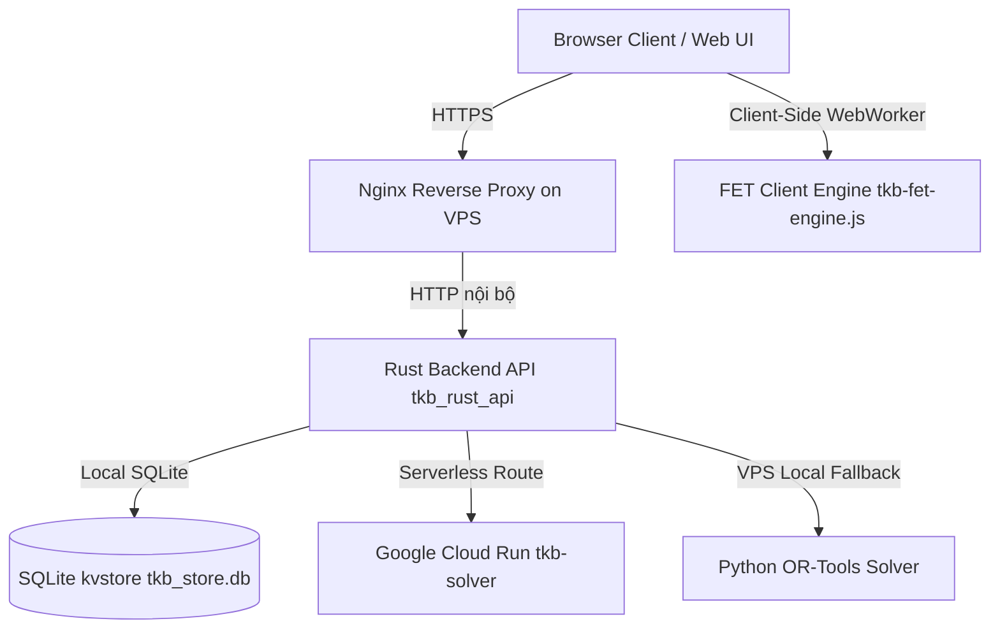

# HƯỚNG DẪN KẾ THỪA VÀ VẬN HÀNH DỰ ÁN TKB CHERRY (TKB TIMETABLE SYSTEM)
*Tài liệu bàn giao kỹ thuật toàn diện dành cho lập trình viên kế thừa dự án.*

> **Đọc kèm:** trạng thái hiện hành ngắn gọn nằm ở [`docs/CURRENT_STATE.md`](docs/CURRENT_STATE.md);
> nhật ký chi tiết từng phiên làm việc ở [`docs/PROJECT_HANDOFF.md`](docs/PROJECT_HANDOFF.md)
> (các mục cũ được chuyển vào `docs/archive/`).

---

## 1. TỔNG QUAN HỆ THỐNG VÀ KIẾN TRÚC (SYSTEM ARCHITECTURE)

Hệ thống **TKB Cherry** (`tkbcherry.com`) là nền tảng quản lý và xếp thời khóa biểu tự động thông minh dành cho trường học phổ thông, hỗ trợ quy mô trường lớn (hơn 70 lớp, hàng ngàn tiết học, hàng trăm giáo viên).



### Các thành phần chính:
1. **Web Client (Frontend)**:
   * **Công nghệ**: HTML5, Vanilla JavaScript (ES6+), Vanilla CSS3. Không dùng framework hay build system; giao tiếp backend qua HTTP polling (không WebSocket).
   * **Giao diện phân môn & sắp xếp TKB**: `web/pages/phanmon.js`, `web/pages/sapxep.html`, `web/pages/phanmon.css`.
   * **Bộ giải & tối ưu FET chạy trực tiếp trên Browser**: `web/pages/tkb-fet-engine.js`, `web/pages/tkb-fet-worker.js`.
   * **Quản trị hệ thống & Cổng trường học**: `web/super-admin.js`, `web/school-portal.js`, `web/app.js`.

2. **Backend API Server (Rust)**:
   * **Thư mục**: `rust_api/`
   * **Công nghệ**: Rust **thuần thư viện chuẩn** — HTTP server tự viết trên `std::net::TcpListener` + thread pool, **không dùng** Axum/Tokio hay framework async nào. Dependency chỉ gồm `argon2`, `serde_json`, `rusqlite`, `sha2` (xem `rust_api/Cargo.toml`).
   * **Xác thực**: mật khẩu băm **Argon2id**; phiên đăng nhập dùng **session token ngẫu nhiên (opaque Bearer token)** lưu trong SQLite — **không phải JWT**. Xem `rust_api/src/auth.rs`.
   * **Chức năng**: quản lý phiên đăng nhập, phân quyền đa cấp, lưu trữ dữ liệu trường học, điều phối tác vụ xếp TKB Serverless (Cloud Run) và VPS local.
   * **Cổng lắng nghe**: cấu hình qua `TKB_RUST_HOST` / `TKB_RUST_PORT` trong `.env`; mặc định local là `127.0.0.1:1010`. Trên VPS, port nội bộ do file service systemd quyết định — kiểm tra cấu hình Nginx/systemd trên máy chủ thay vì giả định.

3. **Solver Runtime (Python OR-Tools)**:
   * **Thư mục**: `solver_runtime/`
   * **Công nghệ**: Python 3.12, Google OR-Tools (CP-SAT Solver), NumPy, SciPy, OpenPyXL.
   * **Chức năng**: Giải bài toán quy hoạch nguyên thỏa mãn ràng buộc (Constraint Programming) — đây là solver chất lượng cao chính chạy trên Cloud Run và VPS.

4. **Hạ tầng Serverless & VPS**:
   * **VPS**: Ubuntu 24.04 LTS, Nginx, Rust Daemon (`/opt/cherry-scheduler/`), SQLite DB (`/opt/cherry-scheduler/rust_api/tkb_store.db`).
   * **Google Cloud Run**: Container image `asia-southeast2-docker.pkg.dev/.../tkb-solver`, xử lý các tác vụ tính toán nặng không tải cho VPS.

---

## 2. CƠ CHẾ LƯU TRỮ DỮ LIỆU & ĐỒNG BỘ ĐA THIẾT BỊ

### 2.1. Cấu trúc Cơ sở Dữ liệu (SQLite KV Store)
Cơ sở dữ liệu SQLite nằm tại `/opt/cherry-scheduler/rust_api/tkb_store.db` (trên VPS), gồm bảng:
```sql
CREATE TABLE IF NOT EXISTS kvstore (
    k TEXT PRIMARY KEY,
    v TEXT NOT NULL
);
```

DB chạy chế độ **WAL**: dữ liệu mới nhất nằm trong `*.db-wal`/`*.db-shm`. Mọi thao tác backup/rsync **phải giữ nguyên bộ ba file** (xem mục 7.1).

### 2.2. Các Key dữ liệu quan trọng:
* `auth_registry`: Chứa toàn bộ danh mục tài khoản (User, Password Hash Argon2id, Roles: `superadmin`, `school_manager`, `viewer`) và danh sách các trường học (`schools`).
* `school_{schoolId}` (ví dụ `school_e3d7a3b21e3`): Chứa toàn bộ dữ liệu TKB của trường đó (PCCM, danh mục môn, lớp, giáo viên, phòng học, ràng buộc, lưới TKB `DATA.tkb`, trạng thái tối ưu).

### 2.3. Cơ chế Auto-Resolve School Context khi mở trên thiết bị mới
* **Vấn đề đã giải quyết**: Khi người dùng đăng nhập trên một thiết bị/trình duyệt mới, `localStorage` chưa có `lastSchoolContext`, trước đây hệ thống có thể mở vào trường `"default"` (trống).
* **Cơ chế hiện tại**: `web/pages/phanmon.js` và `web/app.js` tự động tra cứu từ `TKBAuth.loadRegistry()`: nếu `sid` trống hoặc là `"default"`, hệ thống tự động nhận diện trường có dữ liệu hoạt động đầu tiên của tài khoản (ví dụ `e3d7a3b21e3`) để tải đầy đủ dữ liệu ngay lập tức.

---

## 3. BỘ THUẬT TOÁN XẾP TKB VÀ TỐI ƯU HÓA CHUYÊN SÂU

Bộ thuật toán tối ưu hóa nằm tại `web/pages/tkb-fet-engine.js`:

### 3.1. Thuật toán Xếp Tự Động (FET Schedule Construction)
* Sử dụng chiến lược **MRV (Minimum Remaining Values)** kết hợp **Degree Heuristic**.
* Các tiết cố định và tiết 1 buổi của giáo viên được ưu tiên xếp trước (Fixed & Singleton Priority Queue) để tránh phát sinh tiết lẻ về sau.

### 3.2. Bộ Tối Ưu Hóa Đa Tầng (Multi-Pass Deep Optimization)
Hệ thống cung cấp 4 chế độ tối ưu độc lập:
1. **Tối ưu buổi 1 tiết (`optimize_singletons`)**:
   * Áp dụng **Deep LNS Singleton Consolidation**: Dò tìm các buổi dạy 1 tiết của giáo viên, thực hiện hoán đổi hoặc dời sang các buổi giáo viên đã có tiết để ghép thành cụm $\ge 2$ tiết hoặc giải phóng hoàn toàn ngày nghỉ.
2. **Tối ưu số buổi dạy / ngày dạy (`optimize_sessions`)**:
   * Gom gọn số ngày đến trường của giáo viên, tăng ngày nghỉ trọn vẹn trong tuần.
3. **Tối ưu 2 tiết trống (`optimize_gap2`)**:
   * **Chuỗi Dịch Chuyển Vòng 3 Bước (3-Way Multi-Hop Ejection Chain)**: Khi gặp nút thắt (ví dụ Thầy Thành có tiết cố định Tiết 5 và tiết di động Tiết 1), bộ giải kích hoạt chuỗi hoán vị vòng 3–5 bước giữa các lớp để kéo tiết di động áp sát vào mỏ neo cố định.
   * **Ràng buộc cứng (Hard Invariant)**: Không cho phép làm tăng số buổi 1 tiết (`soBuoiDay1 <= initial.soBuoiDay1`).
4. **Tối ưu 1 tiết trống (`optimize_gap1`)**:
   * Tinh chỉnh các lỗ hổng 1 tiết xen kẽ giữa các giờ học.

### 3.3. Bảng Thống Kê Theo Lớp (Class Statistics Table)
Bảng thống kê (`openClassAssignmentStatistics()` trong `web/pages/phanmon.js`) bao gồm các nhóm cột:
* **TT & Lớp học** (Cố định cột trái).
* **Tổng số theo PCCM**: Tiết đơn, Tiết ghép, Cộng (Tổng số tiết được phân công).
* **Tình trạng xếp**:
  * **Đã xếp** (Xanh lá): Tổng số tiết đã được xếp lên lưới TKB của lớp.
  * **Chưa xếp** (Đỏ/Xám): Số tiết còn thiếu chưa được xếp (`Cộng - Đã xếp`).
  * **Trống** (Xanh dương): Đếm chính xác số ô trống (tiết chưa có lịch) trên lưới TKB của lớp (loại trừ các ô OFF).
* **Chi tiết từng môn**: Thống kê số tiết của từng môn học.
* **Dòng Tổng cộng (Footer)**: Tính tổng toàn trường cho tất cả các chỉ số.

---

## 4. QUY TRÌNH TRIỂN KHAI VÀ VẬN HÀNH (DEPLOYMENT RUNBOOK)

### 4.1. Cập nhật và Triển khai lên VPS (`tkbcherry.com`)
Trên máy phát triển (Windows PowerShell / CMD):
```powershell
cd C:\Users\Love\Documents\Codex\TKBCherry
python tools/vps-deploy/update-deploy.py
```
*Script sẽ tự động:*
1. Nén các tệp mã nguồn mới (`web/`, `rust_api/`, `solver_runtime/`, `nginx/`).
2. Tải lên VPS qua SSH/SFTP an toàn.
3. Backup trạng thái máy chủ (`STATE_BACKUP`, `RELEASE_BACKUP`).
4. Build bản tối ưu Rust (`cargo build --release`).
5. Drain các tác vụ solver đang chạy an toàn và reload Nginx / Service.
6. Kiểm tra health-check và in ra `UPDATE_OK`.

### 4.2. Cập nhật và Triển khai lên Google Cloud Run
```powershell
cd C:\Users\Love\Documents\Codex\TKBCherry
powershell -ExecutionPolicy Bypass -File tools\cloud-run\deploy.ps1 `
    -ProjectId project-61ee7855-507e-40a3-879 `
    -InvokerServiceAccount tkb-cloud-run-invoker@project-61ee7855-507e-40a3-879.iam.gserviceaccount.com `
    -RuntimeServiceAccount tkb-cloud-run-runtime@project-61ee7855-507e-40a3-879.iam.gserviceaccount.com `
    -ConfirmDeployment
```
*Script sẽ tự động:*
1. Đóng gói mã nguồn solver runtime.
2. Build container image qua Google Cloud Build.
3. Deploy revision mới lên Cloud Run (khu vực `asia-southeast2`).
4. Chạy canary health check và chuyển 100% traffic sang revision mới.

### 4.3. Chạy môi trường Local Development
```powershell
cd C:\Users\Love\Documents\Codex\TKBCherry
python start.py
```
Hệ thống khởi chạy local server tại **`http://127.0.0.1:1010/`** (port đặt trong `.env`, biến `TKB_RUST_PORT`). Đóng cửa sổ điều khiển TKB để dừng backend và giải phóng port.

### 4.4. Kiểm thử tự động (CI trên GitHub Actions)
Workflow `.github/workflows/tests.yml` chạy trên mỗi push/PR:
* **Python**: cài `solver_runtime/requirements.txt`, chạy toàn bộ `solver_runtime/tests/`.
* **Node**: `node --check` toàn bộ JS trong `web/` và chạy các bộ test node không cần server trong `e2e_tests/`.
* **Rust**: `cargo check` + `cargo test` (Linux, cần `libsqlite3-dev`); `cargo clippy` chạy ở chế độ cảnh báo.

Ba bộ test cần backend đang chạy (`app_assignment_subject_visibility`, `app_data_integrity`, `tkb_rust_bridge`) vẫn chạy thủ công qua `python run_e2e_tests.py` trước khi deploy.

---

## 5. DANH MỤC TỆP TIN VÀ CẤU TRÚC THƯ MỤC CHÍNH

| Đường dẫn tệp | Chức năng chính |
| :--- | :--- |
| `web/pages/phanmon.js` | Logic phân công chuyên môn, hiển thị TKB, quản lý bảng thống kê lớp/GV, điều phối giao diện |
| `web/pages/phanmon.css` | Toàn bộ định kiểu giao diện TKB, bảng thống kê modal, responsive mobile/desktop |
| `web/pages/tkb-fet-engine.js` | Thuật toán xếp FET & các bộ tối ưu chuyên sâu (Singletons, Sessions, Gap2, Gap1) |
| `web/pages/tkb-fet-worker.js` | Web Worker chạy nền thuật toán FET không gây đơ giao diện trình duyệt |
| `web/pages/tkb-rust-bridge.js` | Bridge UI ↔ backend: precheck, dispatch solve, theo dõi job, áp kết quả |
| `web/pages/tkb-constraints-menu.js` | Menu ràng buộc TKB, popup Thống kê theo lớp, xuất in ấn TKB |
| `web/pages/sapxep.html` | Trang xếp thời khóa biểu chính |
| `web/app.js` | Router chính, xác thực phiên đăng nhập, điều hướng trường học |
| `web/super-admin.js` | Giao diện Super Admin (quản lý người dùng, trường học, cấu hình Google Cloud Profile) |
| `rust_api/src/main.rs` | Entry point + HTTP server tự viết + toàn bộ route của Rust Backend |
| `rust_api/src/auth.rs` | Xác thực người dùng (Argon2id + session token), phân quyền trường học |
| `rust_api/src/solver_pool.rs` | Solver pool FIFO theo CPU token, quản lý job đa trường |
| `solver_runtime/src/tkb_new/adapter.py` | Adapter chính của solver Python: dựng model, chạy CP-SAT/MILP, trả kết quả |
| `solver_runtime/src/tkb_optimizer_ref/pipeline.py` | Pipeline giải toán CP-SAT / MILP qua Google OR-Tools trên Python |
| `solver_runtime/scripts/cloud_run_service.py` | Service endpoint nhận request solve trên Google Cloud Run |
| `tools/vps-deploy/update-deploy.py` | Script tự động hóa build và deploy lên VPS một bước |
| `tools/cloud-run/deploy.ps1` | Script tự động hóa build container và deploy lên Google Cloud Run |

---

## 6. LƯU Ý QUAN TRỌNG KHI KẾ THỪA DỰ ÁN
1. **Duy nhất một thư mục chuẩn**: Toàn bộ dự án hoạt động duy nhất tại `C:\Users\Love\Documents\Codex\TKBCherry` (thư mục mã nguồn `TKBCherry/`). Không sử dụng hay tham chiếu đến các thư mục ngoài nào khác. Remote chuẩn là `https://github.com/thoikhoabieucherry/TKBCherry` — commit và push thường xuyên để quản lý online.
2. **Không sửa trực tiếp trên DB VPS mà không backup**: Trước khi thực hiện bất kỳ thao tác thủ công nào trên `/opt/cherry-scheduler/rust_api/tkb_store.db`, luôn copy ra một file backup `.tar.gz`.
3. **Cấu hình Cloud Run Profile**: Thông tin profile Cloud Run an toàn nằm trong Super Admin -> Đổi tài khoản Google Cloud. Nếu thay đổi tài khoản GCP, chỉ cần chạy lại `deploy.ps1` với `ProjectId` mới và dán JSON profile kết quả vào giao diện Super Admin.
4. **Cơ chế Auto-Resolve School**: Không cần lo lắng việc mở nhầm trường `"default"` khi đăng nhập thiết bị mới, hệ thống đã tích hợp cơ chế tự động tìm trường có dữ liệu hợp lệ đầu tiên của tài khoản.
5. **Giữ tài liệu đồng bộ với mã nguồn**: file này từng mô tả sai backend (Axum/Tokio/JWT, port 8787) — đã sửa ngày 2026-08-16. Khi thay đổi kiến trúc, cập nhật cả file này lẫn `docs/CURRENT_STATE.md`; đối chiếu `Cargo.toml`/`.env.example` trước khi mô tả công nghệ.

---

## 7. CÁC KIẾN TRÚC VÀ BẢN VÁ LỖI CỐT LÕI CẦN CHÚ Ý (IMPORTANT FIXES)
1. **Lỗi Mất Dữ Liệu Khi Deploy (Data Loss during Deploy)**:
   * **Bối cảnh**: Cơ sở dữ liệu SQLite (`rust_api/tkb_store.db`) chạy ở chế độ **WAL (Write-Ahead Logging)**. Dữ liệu mới nhất nằm trong các tệp `*.db-wal` và `*.db-shm`.
   * **Vấn đề cũ**: Script deploy `rsync` chỉ loại trừ `*.db`, vô tình xóa mất `*.db-wal` làm SQLite rollback mất dữ liệu của người dùng.
   * **Đã sửa**: Tại `tools/vps-deploy/update-server.sh`, lệnh rsync và backup đã được cập nhật cờ `--exclude='*.db-wal'`, `--exclude='*.db-shm'` (và các file `.sqlite` tương đương). **AI kế thừa tuyệt đối không được xóa bỏ các quy tắc exclude này trong file deploy**.
2. **Kiến Trúc Hybrid Solver (Cloud Run CP-SAT)**:
   * **Bối cảnh**: Khi người dùng bật tính năng "⚡ Hybrid ON" trên UI, frontend sẽ tự động đóng gói request gửi qua Rust API (`tkb_rust_api`) lên Google Cloud Run thay vì chạy FET Engine tại Web Worker.
   * **Vấn đề cũ**: Lỗi `ReferenceError: mode is not defined` trong `executeDirectFastSchedule` (file `web/pages/phanmon.js`) khiến lệnh dispatch bị crash ngầm, hệ thống bắt catch lỗi và tự động fallback về local (người dùng tưởng Cloud Run đang chạy nhưng thực tế là chạy bằng CPU trình duyệt). Đã sửa bằng cách truy xuất đúng `options.mode`.
   * **Theo dõi Metric Badge**: Trong quá trình giải Hybrid, server trả về tiến trình (ví dụ: `2193/2193 tiết`). Nếu đang ở chế độ Tối ưu chuyên sâu (VD: Trống 2 tiết), frontend sẽ bỏ qua tín hiệu tiến trình chung (`isSystemNoise`) để giữ vững nhãn tiến trình tối ưu (VD: `Trống 2 tiết: 25`) không bị nhấp nháy, chớp giật.
3. **Giao Diện Metric Badge**:
   * Badge `.auto-sort-metric` trong `web/pages/phanmon.css` sử dụng `width: max-content !important` để bao bọc toàn bộ chuỗi text động một cách mượt mà, tránh tình trạng "chữ không bao hết khung" do thẻ flex.
