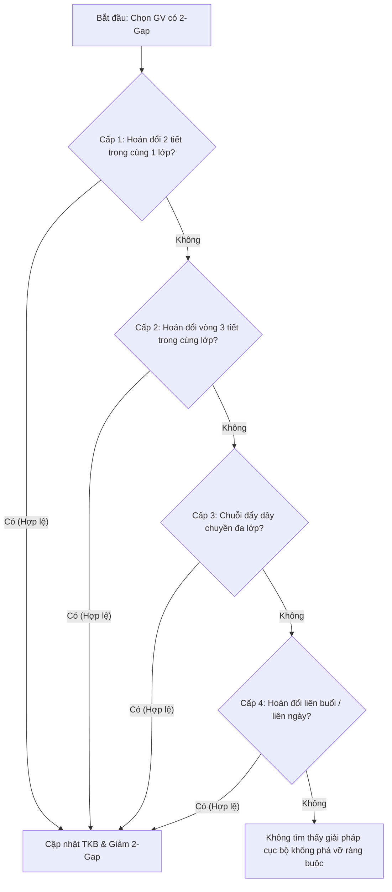

# BÁO CÁO PHÂN TÍCH VÀ SUY LUẬN THUẬT TOÁN TỐI ƯU 2 TIẾT TRỐNG (SMARTSCHEDULER)

---

## I. TỔNG QUAN VỀ BÀI TOÁN TỐI ƯU TIẾT TRỐNG

### 1. Khái niệm Tiết trống (Windows / Gaps)
Trong xếp thời khóa biểu trường học (mỗi buổi gồm 5 tiết: Tiết 1 đến Tiết 5):
- Với mỗi giáo viên trong một buổi (Sáng hoặc Chiều), gọi $P_{min}$ là tiết dạy đầu tiên và $P_{max}$ là tiết dạy cuối cùng.
- Bất kỳ tiết nào nằm giữa $[P_{min}, P_{max}]$ mà giáo viên không có giờ dạy được gọi là **tiết trống (gap)**.
- **Tiết trống 2 tiết (2-period gap)**: Là khoảng trống có đúng 2 tiết liên tiếp không dạy giữa các tiết dạy (Ví dụ: Dạy Tiết 1 và Tiết 4 $\rightarrow$ Trống Tiết 2, 3; Dạy Tiết 2 và Tiết 5 $\rightarrow$ Trống Tiết 3, 4).
- Tiết trống 2 tiết gây lãng phí thời gian lớn cho giáo viên (thời gian chờ từ 90 đến 120 phút tại trường), nên việc khử triệt để các khoảng trống 2 tiết là một mục tiêu tối ưu quan trọng hàng đầu trong SmartScheduler.

---

## II. PHÂN TÍCH HAI BỘ DỮ LIỆU THỰC TẾ

### 1. Bộ dữ liệu 1 (`vesion/`): Tối ưu cục bộ độc lập cho từng Giáo viên từ `base.xlsx`
Ở bộ dữ liệu này, quy trình là: Xuất phát từ bản gốc `base.xlsx`, chọn từng giáo viên mục tiêu để tối ưu cục bộ (Local Repair):
- `base.xlsx` $\rightarrow$ `T.Thắm.xlsx`: Giảm từ 1 gap-2 về 0 gap-2.
- `base.xlsx` $\rightarrow$ `Á.Quyên.xlsx`: Giảm từ 1 gap-2 về 0 gap-2.
- `base.xlsx` $\rightarrow$ `K.Phát.xlsx`: Giảm từ 1 gap-2 về 0 gap-2.
- `base.xlsx` $\rightarrow$ `T.Hương.2.xlsx`: Giảm từ 1 gap-2 về 0 gap-2.
- `base.xlsx` $\rightarrow$ `H.Nam.xlsx`: Giảm từ 3 gap-2 về 0 gap-2.

### 2. Bộ dữ liệu 2 (`SmartScheduler/temp/`): Chuỗi tối ưu tuần tự toàn trường (`base` $\rightarrow$ `1` $\rightarrow$ `2` $\rightarrow$ ... $\rightarrow$ `20`)
- **Trạng thái ban đầu (`base.xlsx`)**: Toàn trường có **24 khoảng trống 2 tiết** và **166 khoảng trống 1 tiết**.
- **Sau 20 bước tối ưu tuần tự**: Khử sạch hoàn toàn **24 / 24 khoảng trống 2 tiết** (về 0), số khoảng trống 1 tiết tăng nhẹ lên 196 (do 1 khoảng trống 2 tiết được co lại thành 1 khoảng trống 1 tiết).

#### Bảng tổng hợp tiến trình 20 bước:
| Bước | File | Giáo viên hưởng lợi | 2-Gaps còn lại | 1-Gaps còn lại | Số lớp bị tác động | Số GV tham gia |
| :---: | :---: | :---: | :---: | :---: | :---: | :---: |
| **Gốc** | `base.xlsx` | *(Khởi tạo)* | **24** | 166 | - | - |
| **1** | `1.xlsx` | **T.Thắm** ($1 \rightarrow 0$) | **23** | 168 | 1 lớp (`6/4`) | 2 GV (`T.Thắm`, `P.My`) |
| **2** | `2.xlsx` | **Á.Quyên** ($1 \rightarrow 0$) | **22** | 170 | 1 lớp (`8/14`) | 2 GV (`Á.Quyên`, `T.Hương.1`) |
| **3** | `3.xlsx` | **H.Nam** ($3 \rightarrow 0$) | **19** | 170 | 5 lớp (`8/10`, `9/1`, `9/2`, `9/4`, `9/6`) | 10 GV |
| **4** | `4.xlsx` | **K.Phát** ($1 \rightarrow 0$) | **18** | 171 | 1 lớp (`8/2`) | 2 GV (`K.Phát`, `N.Châu`) |
| **5** | `5.xlsx` | **T.Hương.2** ($1 \rightarrow 0$) | **17** | 172 | 1 lớp (`9/13`) | 5 GV |
| **6** | `6.xlsx` | **T.Loan.1** ($1 \rightarrow 0$) | **16** | 172 | 2 lớp (`6/7`, `6/8`) | 4 GV |
| **7** | `7.xlsx` | **T.Thanh** ($1 \rightarrow 0$) | **15** | 174 | 1 lớp (`8/15`) | 2 GV (`T.Thanh`, `T.Anh.2`) |
| **8** | `8.xlsx` | **B.Công** ($2 \rightarrow 0$) | **13** | 176 | 2 lớp (`8/4`, `8/16`) | 4 GV |
| **9** | `9.xlsx` | **T.Bảo** ($1 \rightarrow 0$) | **12** | 176 | 2 lớp (`8/2`, `6/6`) | 4 GV |
| **10** | `10.xlsx` | **T.Hiền.1** ($1 \rightarrow 0$) | **11** | 178 | 2 lớp (`8/15`, `9/12`) | 3 GV |
| **11** | `11.xlsx` | **T.Cúc** ($1 \rightarrow 0$) | **10** | 180 | 2 lớp (`9/4`, `9/8`) | 3 GV |
| **12** | `12.xlsx` | **T.Tín** ($1 \rightarrow 0$) | **9** | 180 | 1 lớp (`9/8`) | 7 GV |
| **13** | `13.xlsx` | **T.Cường** ($1 \rightarrow 0$) | **8** | 181 | 1 lớp (`9/9`) | 2 GV (`T.Cường`, `D.Quyên`) |
| **14** | `14.xlsx` | **N.Kiên** ($1 \rightarrow 0$) | **7** | 182 | 2 lớp (`6/7`, `7/10`) | 8 GV |
| **15** | `15.xlsx` | **T.Thư** ($2 \rightarrow 0$) | **5** | 185 | 3 lớp (`6/5`, `6/7`, `7/5`) | 5 GV |
| **16** | `16.xlsx` | **T.Thảo.3** ($1 \rightarrow 0$) | **4** | 186 | 1 lớp (`6/9`) | 4 GV |
| **17** | `17.xlsx` | **B.Tặng** ($1 \rightarrow 0$) | **3** | 188 | 1 lớp (`6/8`) | 2 GV (`B.Tặng`, `X.Huy`) |
| **18** | `18.xlsx` | **T.Hiền.2** ($1 \rightarrow 0$) | **2** | 190 | 4 lớp (`7/10`, `8/1`, `8/3`, `8/11`) | 8 GV |
| **19** | `19.xlsx` | **T.Tuyết** ($1 \rightarrow 0$) | **1** | 194 | 2 lớp (`7/1`, `8/7`) | 5 GV |
| **20** | `20.xlsx` | **M.Tuấn** ($1 \rightarrow 0$) | **0** | 196 | 1 lớp (`7/3`) | 2 GV (`M.Tuấn`, `T.Hương.3`) |

---

## III. SUY LUẬN NGUYÊN LÝ VÀ THUẬT TOÁN CỦA PHẦN MỀM

Từ các biến đổi cụ thể trong dữ liệu, phần mềm SmartScheduler vận hành theo mô hình **Tìm kiếm Cục bộ Đa Tầng (Multi-tier Local Search / Variable Neighborhood Descent)** kết hợp với **Chuỗi Đẩy Hoán Vị (Ejection Chain Search / Kempe Chain)**.

Thuật toán hoạt động theo 4 cấp độ toán tử di chuyển (Neighborhood Operators) từ đơn giản đến phức tạp:



### 1. Cấp 1: Hoán đổi 2 tiết trực tiếp trong cùng một lớp (Intra-Class 2-Period Swap)
- **Cơ chế**: Xét tiết $P_{target}$ của giáo viên $G_1$ (đang ở biên tạo ra khoảng trống). Thuật toán thử đổi tiết $P_{target}$ với một tiết $P_{adj}$ gần hơn (tiết 2 hoặc tiết 3) đang do giáo viên $G_2$ dạy trong cùng lớp $C$.
- **Điều kiện hợp lệ**:
  - $G_2$ đang rảnh ở tiết $P_{target}$.
  - Sau khi đổi, $G_2$ không bị phát sinh vi phạm hoặc khoảng trống 2 tiết mới.
- **Minh chứng thực tế**:
  - **Bước 1 (`T.Thắm`)**: Tại Lớp 6/4 Thứ 5 Sáng:
    $$\text{Tiết 1 (SĐ - T.Thắm)} \longleftrightarrow \text{Tiết 2 (GDCD - P.My)}$$
    $\Rightarrow$ T.Thắm chuyển sang dạy Tiết 2 và Tiết 4 (khoảng trống giảm từ `[2, 3]` thành `[3]`). P.My trước đó rảnh Tiết 1 nên không bị trùng lịch.
  - **Bước 2 (`Á.Quyên`)**: Tại Lớp 8/14 Thứ 3 Sáng:
    $$\text{Tiết 1 (SĐ - Á.Quyên)} \longleftrightarrow \text{Tiết 2 (Toán - T.Hương.1)}$$
    $\Rightarrow$ Á.Quyên chuyển sang Tiết 2 và Tiết 4.
  - **Bước 7 (`T.Thanh`)**, **Bước 13 (`T.Cường`)**, **Bước 17 (`B.Tặng`)**, **Bước 20 (`M.Tuấn`)** đều sử dụng toán tử Cấp 1 này.

---

### 2. Cấp 2: Hoán đổi vòng 3 tiết trong cùng lớp (Intra-Class 3-Cycle Swap)
- **Cơ chế**: Khi đổi 2 tiết trực tiếp $(G_1, G_2)$ bị kẹt do $G_2$ bận tại $P_1$, thuật toán tìm chu trình xoay vòng 3 tiết $(P_1, P_2, P_3)$ giữa 3 giáo viên $(G_1, G_2, G_3)$ trong cùng lớp:
  $$P_1(G_1) \rightarrow P_2; \quad P_2(G_2) \rightarrow P_3; \quad P_3(G_3) \rightarrow P_1$$
- **Minh chứng thực tế**:
  - **`K.Phát.xlsx` (bộ `vesion`)**: Tại Lớp 8/2 Thứ 3 Sáng:
    - Tiết 1: MT (K.Phát) $\longrightarrow$ chuyển sang Tiết 2
    - Tiết 2: Văn (N.Thu) $\longrightarrow$ chuyển sang Tiết 3
    - Tiết 3: Toán (N.Châu) $\longrightarrow$ chuyển sang Tiết 1
    $\Rightarrow$ K.Phát vào Tiết 2, N.Thu chuyển Tiết 3, N.Châu nhận Tiết 1. Cả 3 giáo viên đều thỏa mãn không trùng lịch ở các lớp khác.
  - **Bước 6 (`T.Loan.1`)**: Tại Lớp 6/8 Thứ 5 Sáng:
    - Tiết 1: TNHN-CN (T.Loan.1) $\longrightarrow$ Tiết 2
    - Tiết 2: GDTC (V.Hiệp) $\longrightarrow$ Tiết 3
    - Tiết 3: Văn (T.Nguyệt.2) $\longrightarrow$ Tiết 1

---

### 3. Cấp 3: Chuỗi hoán đổi đẩy dây chuyền đa lớp (Cross-Class Ejection Chain)
- **Cơ chế**: Khi việc hoán đổi trong 1 lớp làm giáo viên $G_2$ bị chiếm chỗ mà $G_2$ không thể dạy ở tiết còn lại của lớp đó, nhưng $G_2$ lại có tiết ở một lớp khác $C_2$, thuật toán kích hoạt chuỗi đẩy lan truyền (Ejection Chain) sang lớp $C_2$, điều chỉnh tiết của $G_2$ ở $C_2$ và kéo theo $G_3$ ở $C_2$.
- **Minh chứng thực tế**:
  - **`T.Hương.2.xlsx` (Chuỗi liên kết qua 3 lớp: 9/13 $\rightarrow$ 6/1 $\rightarrow$ 6/12)**:
    1. Lớp 9/13 Thứ 2: Đẩy `NNgữ(T.Hương.2)` từ P4 lên P3 $\rightarrow$ `KHTN(T.Bình.2)` lên P2 $\rightarrow$ `MT(B.Trang)` phải chuyển sang P4.
    2. Nhưng B.Trang đang dạy Tiết 4 ở lớp 6/1 $\rightarrow$ Lớp 6/1 đổi: `Nhạc(B.Trang)` từ P4 sang P2 $\rightarrow$ `Văn(T.Thúy)` bị đẩy sang P4.
    3. Nhưng T.Thúy đang dạy Tiết 4 ở lớp 6/12 $\rightarrow$ Lớp 6/12 đổi: `Văn(T.Thúy)` từ P4 sang P2 $\rightarrow$ `Toán(T.Vy)` nhận P4 (T.Vy hoàn toàn rảnh ở P4). Chuỗi đóng an toàn!
  - **Bước 18 (`T.Hiền.2`)**: Chuỗi lan truyền liên kết 4 lớp (`7/10`, `8/1`, `8/3`, `8/11`) với 8 giáo viên tham gia để giải phóng tiết cho T.Hiền.2.

---

### 4. Cấp 4: Hoán đổi liên buổi / liên ngày (Cross-Day / Cross-Session Moves)
- **Cơ chế**: Khi toàn bộ các khe trong cùng một ngày bị nghẽn (do các môn song song hoặc các GV khác đều kín lịch), thuật toán mở rộng không gian tìm kiếm sang các ngày khác hoặc buổi khác (Sáng $\leftrightarrow$ Chiều).
- **Minh chứng thực tế**:
  - **Bước 3 (`H.Nam`)**: Lớp 9/6 hoán đổi giữa Thứ 4 Sáng P4 với Thứ 6 Sáng P1/P2/P3; Lớp 9/4 hoán đổi giữa Thứ 4 Sáng P1 với Thứ 5 Sáng P1/P3.
  - **Bước 10 (`T.Hiền.1`)**: Lớp 8/15 hoán đổi giữa Thứ 2 Chiều P2 với Thứ 6 Sáng P4.
  - **Bước 16 (`T.Thảo.3`)**: Lớp 6/9 hoán đổi giữa Thứ 2 Chiều P3, Thứ 2 Sáng P3 với Thứ 3 Chiều P2 và Thứ 3 Sáng P3.

---

## IV. CÔNG THỨC HÀM MỤC TIÊU VÀ NGUYÊN TẮC ĐÁNH ĐỔI (TRADE-OFF)

Phần mềm thiết lập hàm phạt (Penalty Function):

$$\text{Cost}(S) = W_{hard} \cdot \sum \text{Violations}_{hard} + W_{gap2} \cdot \sum \text{Gap}_2 + W_{gap1} \cdot \sum \text{Gap}_1$$

Trong đó:
1. $W_{hard} = \infty$: Ràng buộc cứng tuyệt đối (không trùng giáo viên, không trùng lớp, đúng số tiết phân công).
2. $W_{gap2} \gg W_{gap1}$: Trọng số phạt của 2 tiết trống cao gấp nhiều lần so với 1 tiết trống.

> [!NOTE]
> **Quy luật đánh đổi trong dữ liệu thực tế**:
> Khi tối ưu từ `base` $\rightarrow$ `20`:
> - Số lượng **2-Gaps** giảm từ **24 $\longrightarrow$ 0** (Khử sạch 100%).
> - Số lượng **1-Gaps** tăng từ **166 $\longrightarrow$ 196** (+30 tiết trống 1 tiết).
> 
> Điều này khẳng định thuật toán ưu tiên biến **1 khoảng trống 2 tiết thành 1 (hoặc 2) khoảng trống 1 tiết** nếu không thể gom liền hoàn toàn, vì 1 tiết trống (45 phút) là chấp nhận được đối với giáo viên (nghỉ giải lao giữa giờ), trong khi 2 tiết trống (90-120 phút) gây ức chế lớn.

---

## V. TỔNG KẾT QUY TRÌNH THUẬT TOÁN ĐẦY ĐỦ (ALGORITHM WORKFLOW)

```
ALGORITHM: Optimize_Two_Period_Gaps(TKB_Base)
INPUT: Thời khóa biểu TKB_Base
OUTPUT: TKB_Optimized không còn khoảng trống 2 tiết

1. Khởi tạo TKB = TKB_Base
2. Lặp danh sách GV có Gap_2 trong TKB:
   a. Với mỗi khoảng Gap_2 của giáo viên G tại (Day, Session):
      i.   Thử Cấp 1 (Intra-Class 2-Swap):
           Tìm tiết P_adj trong cùng lớp sao cho swap(P_target, P_adj) hợp lệ và giảm Gap_2.
      ii.  Nếu không thành công, thử Cấp 2 (Intra-Class 3-Cycle):
           Tìm chu trình xoay vòng 3 tiết trong cùng lớp.
      iii. Nếu không thành công, thử Cấp 3 (Ejection Chain):
           Xây dựng đồ thị xung đột (Conflict Graph), tìm đường đi ngắn nhất (BFS) qua các lớp liên kết.
      iv.  Nếu không thành công, thử Cấp 4 (Cross-Day Swap):
           Mở rộng tìm kiếm hoán đổi liên ngày/liên buổi.
      v.   Thực thi nước đi (Commit Move) có Cost cải thiện tốt nhất.
3. Lặp lại bước 2 cho đến khi không còn Gap_2 nào hoặc đạt giới hạn số lần duyệt.
4. Trả về TKB_Optimized.
```
